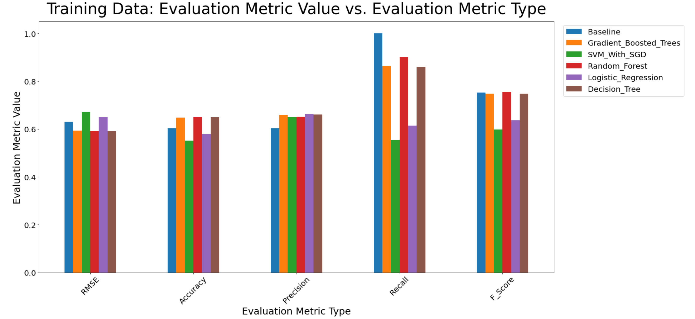
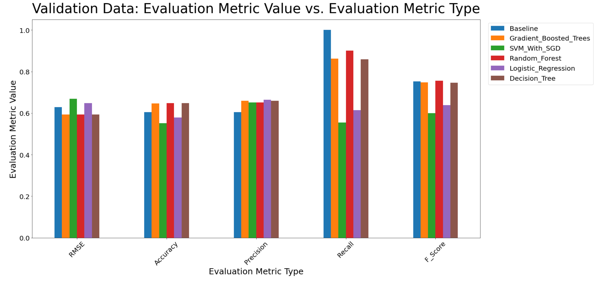

<p align="center">
    
    
</p>

# Stack Overflow Answer Classifier

## Table of Contents
- [Introduction](#introduction)
- [Features](#features)
- [Launch](#launch)
- [Screenshots](#screenshots)
- [Contributors](#contributors)

## Introduction
This is a PySpark project which pre-processes and classifies answers to questions on Stack Overflow as having successfully answered the question or not.

This PySpark application was created for a Big Data final group project for the course [SENG 550: Engineering Large Scale Analytics Systems](https://www.ucalgary.ca/pubs/calendar/current/software-engineering.html#43920).

The dataset used to train and test the application was posted by Chris Dubois of the University of California, Irvine, and can be found [here
](https://www.ics.uci.edu/~duboisc/stackoverflow/). 

## Features
- Pre-processes metadata of answer to questions on Stack Overflow.
- Classifies answers as successfully answering a question based on if it is likely to have a community given score of at least 1.
- NumPy style documentation for maintainability and clarity of application.

## Launch
### Setup
To install necessary virtual environment, in a terminal enter:
```
pipenv install
```
To activate virtual environment needed to run application, in a terminal enter:
```
pipenv shell
```
To run application, in the opened shell, enter:
```
jupyter lab
```
This will open a jupyter lab tab in your default browser, in which you can run the application.

## Screenshots
### Training Data Evaluation Metrics for Each Classifier


Explanation for recall being 1: The baseline model is just the mean value of the labels rounded to the nearest integer. In the case of this data set, that mean value rounded up to 1. Therefore, the baseline model will never have a false negative due it always classifying a sample as "relevant" (i.e., the label is always 1). This results in the Recall just being equivalent to TP (Number of true positives) over TP, which is just 1.

### Validation Data Evaluation Metrics for Each Classifier


## Technologies
- [Python version 3.8.2](https://www.python.org/downloads/release/python-382/)
- [PySpark](https://spark.apache.org/docs/latest/api/python/index.html)
- [NumPy](https://numpy.org/)
- [Pandas](https://pandas.pydata.org/)

## Contributors
<table>
    <thead>
        <tr>
            <th align="center">
                <a href="https://github.com/NikelausM">
                    
                </a>
            </th>
            <th align="center">
                <a href="https://github.com/umerhassan">
                    
                </a>
            </th>
            <th align="center">
                <a href="https://github.com/sohahemmati">
                    
                </a>
            </th>
            <th align="center">
                <a href="https://github.com/Cong-The-Pencil-Coder">
                    
                </a>
            </th>
        </tr>
    </thead>
<tbody>
<tr>
    <td align="center">
        <a href="https://github.com/NikelausM">Nicolas Mora</a>
    </td>
    <td align="center">
        <a href="https://github.com/umerhassan">Umer Hassan</a>
    </td>
    <td align="center">
        <a href="https://github.com/sohahemmati">Soha Hemmati</a>
    </td>
    <td align="center">
        <a href="https://github.com/Cong-The-Pencil-Coder">Cong Pham</a>
    </td>
</tr>
</tbody>
</table>
